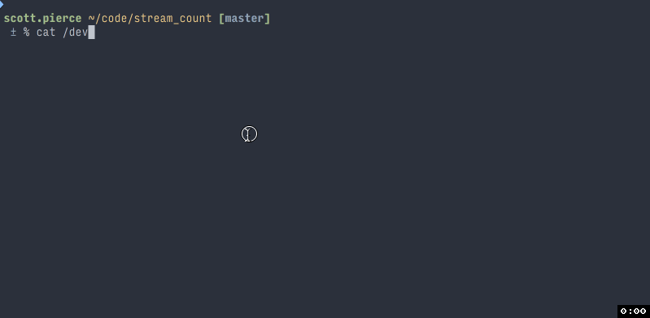

# StreamCount

Output statistics about data from stdin while redirecting the data to stdout.
The statistics are bytes read, bytes read per second, lines read, lines read per
second and total seconds.



## Usage

```sh
cat /dev/random | stream_count > /dev/null

gunzip -c /path/to/file.gz | stream_count > /path/to/unzipped
```

## Installation

Install to local system

    $ gem install stream_count

When using `rbenv` remember to `rbenv rehash`

## Development

After checking out the repo, run `bin/setup` to install dependencies. Then, run `rake spec` to run the tests. You can also run `bin/console` for an interactive prompt that will allow you to experiment.

To install this gem onto your local machine, run `bundle exec rake install`. To release a new version, update the version number in `version.rb`, and then run `bundle exec rake release`, which will create a git tag for the version, push git commits and tags, and push the `.gem` file to [rubygems.org](https://rubygems.org).

## Contributing

Bug reports and pull requests are welcome on GitHub at https://github.com/[USERNAME]/stream_count.

## License

The gem is available as open source under the terms of the [MIT License](http://opensource.org/licenses/MIT).
